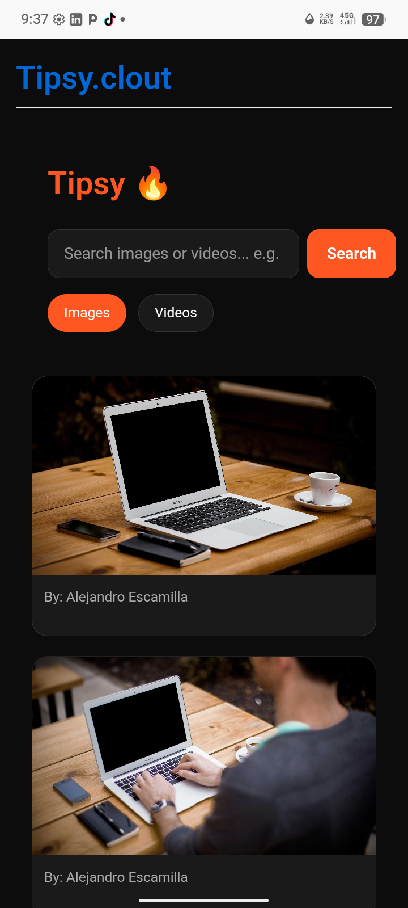

<html lang="en">
<head>
<meta charset="UTF-8">
<meta name="viewport" content="width=device-width, initial-scale=1.0, maximum-scale=1.0">
<title>Clout TECH | Gokah Israel Web Developer</title>
<link href="https://fonts.googleapis.com/css2?family=Poppins:wght@400;600;700&display=swap" rel="stylesheet">

</head>
<body>

<!-- HEADER WITH LOGO -->
<header class="app-header">
    
    
    <h2>Gokah Israel Ewoenam</h2>
    
Web Developer

    

        HTML
        CSS
        JS
        Python
    

    
📍 Afienya, Greater Accra, Ghana

</header>

<!-- MAIN BUTTONS -->
<a href="https://wa.me/233557904956" class="btn btn-whatsapp">💬 WhatsApp: 0557904956</a>
<a href="#pricing" class="btn btn-primary">💰 View Pricing</a>

    <!-- ABOUT -->
    

        <h2>👋 About Clout TECH</h2>
        

            
Clout TECH builds fast, modern websites for schools, businesses, and startups in Ghana.

            
<b style="color:var(--accent)">I'm very ready to work with you.</b>

        

    

    <!-- PRICING -->
    

        <h2>💰 Pricing Packages</h2>
        
        

            <h3>Basic Website</h3>
            
GHS 800 /one-time

            <ul class="pricing-features">
                <li>5 Page Responsive Website</li>
                <li>Mobile Friendly Design</li>
                <li>Contact Form + WhatsApp Button</li>
                <li>7 Days Delivery</li>
            </ul>
            <a href="https://wa.me/233557904956?text=Hi%20Clout%20TECH%20I%20want%20Basic%20Website%20GHS%20800" class="btn btn-whatsapp">Order on WhatsApp</a>
        

        

            MOST POPULAR
            <h3>Business Pro</h3>
            
GHS 1,500 /one-time

            <ul class="pricing-features">
                <li>10 Page Business Website</li>
                <li>Modern UI + Animations</li>
                <li>SEO + Google Setup</li>
                <li>14 Days Support</li>
            </ul>
            <a href="https://wa.me/233557904956?text=Hi%20Clout%20TECH%20I%20want%20Business%20Pro%20GHS%201500" class="btn btn-primary">Order on WhatsApp</a>
        

        

            <h3>School Management System</h3>
            
GHS 2,500 /one-time

            <ul class="pricing-features">
                <li>Student Records + Attendance</li>
                <li>Report Cards + CSV Export</li>
                <li>Admin Dashboard</li>
                <li>1 Month Free Support</li>
            </ul>
            <a href="https://wa.me/233557904956?text=Hi%20Clout%20TECH%20I%20want%20School%20System%20GHS%202500" class="btn btn-whatsapp">Order on WhatsApp</a>
        

    

    <!-- PROJECTS -->
    

        <h2>🚀 My Projects</h2>
        

            
            

                <h3>CLOUT SMS</h3>
                
School management system. Students, attendance, report cards.

                <a href="https://israelclout.github.io/Tipsy.clout/" target="_blank" class="btn-small">Open App</a>
            

        

    

    <!-- CONTACT -->
    

        <h2>📞 Contact</h2>
        

            
<b>Company:</b> Clout TECH

            
<b>Name:</b> Gokah Israel Ewoenam

            
<b>WhatsApp:</b> 0557904956

            <a href="https://wa.me/233557904956" class="btn btn-whatsapp" style="margin-top:15px;width:100%">Chat Now</a>
        

    

<!-- BOTTOM NAV -->
<nav class="bottom-nav">
    <a href="#" class="nav-item active">🏠Home</a>
    <a href="#pricing" class="nav-item">💰Pricing</a>
    <a href="#projects" class="nav-item">📱Projects</a>
    <a href="https://wa.me/233557904956" class="nav-item">💬Contact</a>
</nav>

<footer>
    © 2026 Clout TECH. Built by Gokah Israel
</footer>

</body>
</html>
